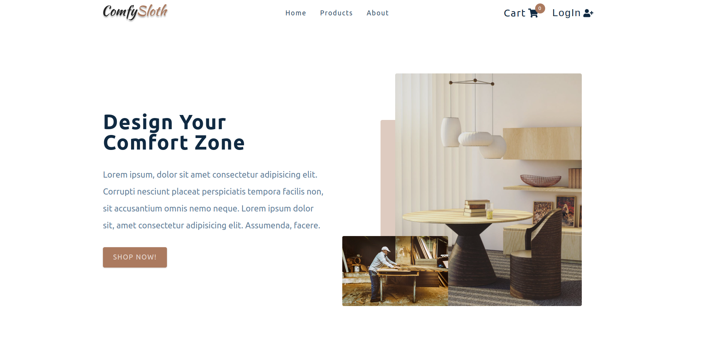
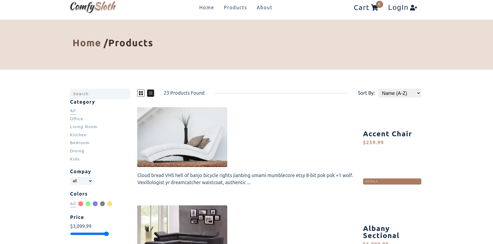
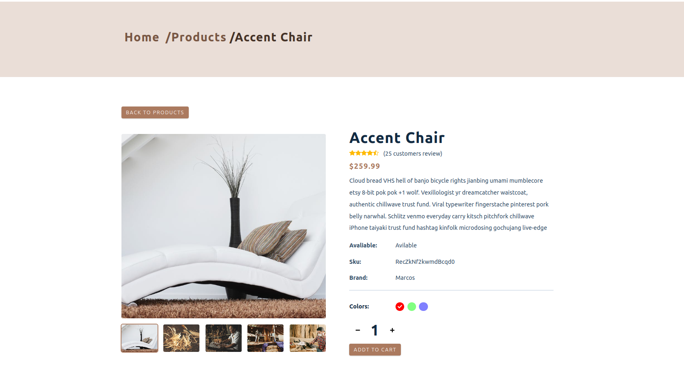
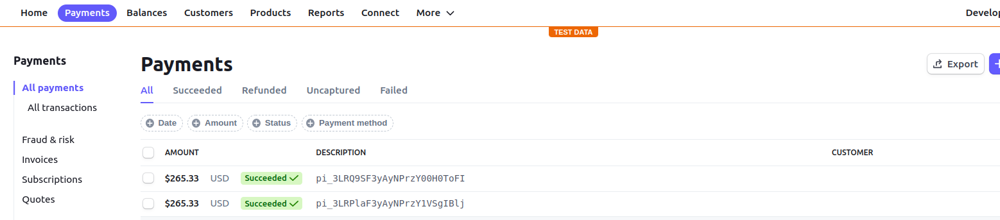

# ComfySloth

<br>

<h3>
ComfySloth is an E-commerce Website for selling furniture,powered by React  
,and consumes json data from a Api endpoint,the app has sing in/out with auth0, persist cart data using localStorage browser api,and use react Context with redux pattern to manage the app state .
</h3>
<br>

[**\_Live Version\_\_**](https://comfy-sloth-maher.netlify.app/)

## features

- singing in/out with E-mail/google/facebook/twitter using auth0
- checking out and paying with credit card using stripe
- persisting cart items in localStorage
- filtering products by price/category / color/ ect...
- responsive in all devices
- subscribing to letter news with email
- JSON-provided data

<br>

## tools & frameworks used

<ul >
	<li style='display:flex;justify-content:start;align-items:center;'>react
		
	</li>
    <li style='display:flex;justify-content:start;align-items:center;'>styled component
		
	</li><li style='display:flex;justify-content:start;align-items:center;'>stripe
		
	</li><li style='display:flex;justify-content:start;align-items:center;'>auth0
		
	</li>
	<li style='display:flex;justify-content:start;align-items:center;'>axios
		
	</li>
	<li style='display:flex;justify-content:start;align-items:center;'>react-router
		
	</li>
	<li style='display:flex;justify-content:start;align-items:center;'>netlify
		
	</li>
    <li style='display:flex;justify-content:start;align-items:center;' >dotenv</li>
    <li style='display:flex;justify-content:start;align-items:center;' >react-icons</li>

</ul>
<br>

## how to use

    just login and start shopping

<br>
<hr/>
<br>

<div style='text-align:center;font-size:20px;'>Home</div>
&nbsp;
<div>
	
	<div style="text-align: center;font-size: 25px;color: antiquewhite;">
		home page without signing in.   
	</div>
</div>
<br>

<hr/>
<br>
<div style='text-align:center;font-size:20px;'>products page</div>
&nbsp;
<div>
	
	<div style="text-align: center;font-size: 25px;color: antiquewhite;">
		products page in list mode and no filters applied .  
	</div>
</div>
<br>

<hr/><br>

<div style='text-align:center;font-size:20px;'>single product page</div>
&nbsp;
<div>
	
	<div style="text-align: center;font-size: 25px;color: antiquewhite;">
		a detailed page for a product after routing to it and displaying all it's info .
	</div>
</div>

<br>
<div style='text-align:center;font-size:20px;'>stripe test payment</div>
&nbsp;
<div>
	
	<div style="text-align: center;font-size: 25px;color: antiquewhite;">
		Stripe dashboard confirmation that a payment is successful.
	</div>
</div>
<br>

<br>

<h3>
<h2>ComfySloth is : </h2>
A React-based, fully responsive website that uses JSON data and combines creative & responsive design along with, best quality furniture.
</h3><br>

<hr/>
<br>

## installation

this application was bootstrapped by CRA .

to install dependencies run:

> npm install

to run the app in **development** mode ,run:

> npm run dev

<br>
<br>

## Contributing

Contributions are certainly welcome. Please feel free to open an issue/PR if there is something you would like to be changed.

<br>

## **_file structure_**

```bash
.
│── functions
│   └── create-payment.js
├── netlify.toml
├── package.json
├── package-lock.json
├── public
│   ├── favicon.ico
│   └──index.html
│  
├── README.md
└── src
    ├── actions.js
    ├── App.js
    ├── assets
    │   ├── hero-bcg-2.jpeg
    │   ├── hero-bcg.jpeg
    │   └── logo.svg
    ├── components
    │   ├── AddToCart.js
    │   ├── AmountButtons.js
    │   ├── CarContent.js
    │   ├── CartButtons.js
    │   ├── CartColumns.js
    │   ├── CartItem.js
    │   ├── CartTotals.js
    │   ├── Contact.js
    │   ├── Error.js
    │   ├── FeaturedProducts.js
    │   ├── Filters.js
    │   ├── Footer.js
    │   ├── GridView.js
    │   ├── Hero.js
    │   ├── index.js
    │   ├── ListView.js
    │   ├── Loading.js
    │   ├── Navbar.js
    │   ├── PageHero.js
    │   ├── ProductImages.js
    │   ├── Product.js
    │   ├── ProductList.js
    │   ├── Services.js
    │   ├── Sidebar.js
    │   ├── Sort.js
    │   ├── Stars.js
    │   └── StripeCheckout.js
    ├── context
    │   ├── cart_context.js
    │   ├── filter_context.js
    │   ├── products_context.js
    │   └── user_context.js
    ├── index.css
    ├── index.js
    ├── pages
    │   ├── AboutPage.js
    │   ├── AuthWrapper.js
    │   ├── CartPage.js
    │   ├── CheckoutPage.js
    │   ├── ErrorPage.js
    │   ├── HomePage.js
    │   ├── index.js
    │   ├── PrivateRoute.js
    │   ├── ProductsPage.js
    │   └── SingleProductPage.js
    ├── reducers
    │   ├── cart_reducer.js
    │   ├── filter_reducer.js
    │   └── products_reducer.js
    └── utils
        ├── constants.js
        ├── helpers.js
        └── mock.js

```

<hr/>

## Acknowledgements

Great thanks to:

1. [john smilga](https://www.johnsmilga.com/)
2. [the odin project](wwww.theodinproject.com)
<br>
<hr >
<br>

## License

[MIT](./LICENSE.md)
